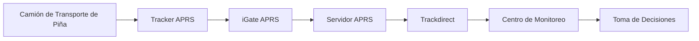
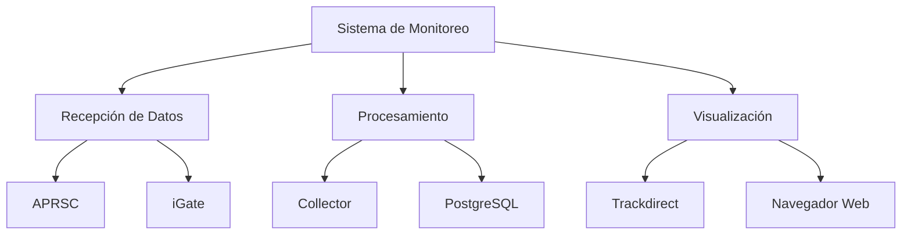
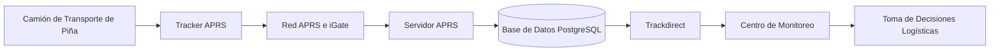
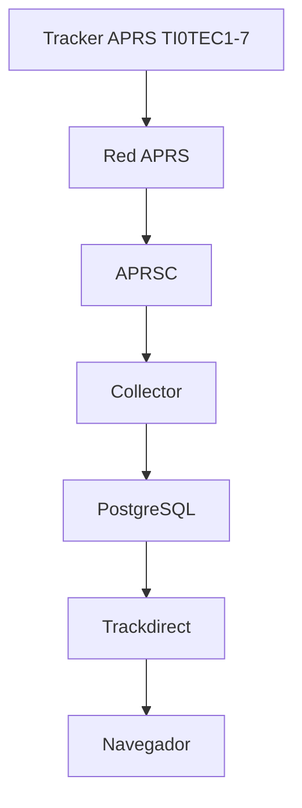
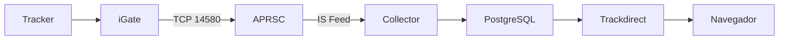
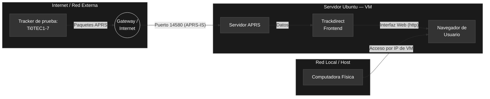
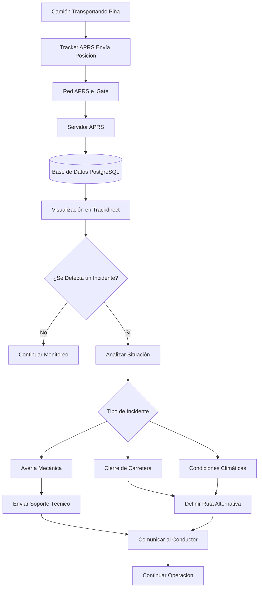
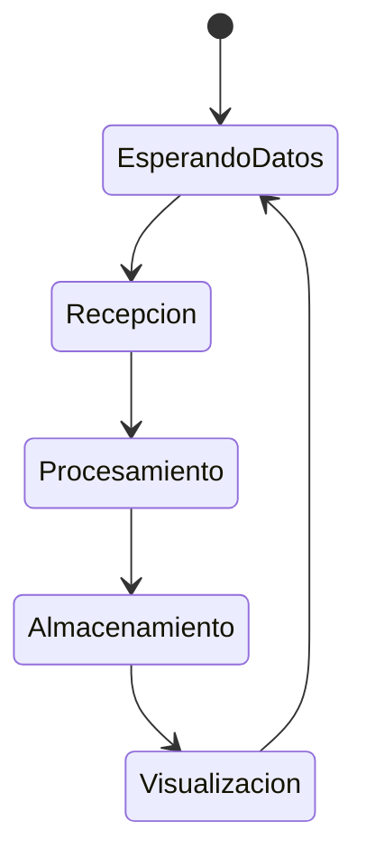

# Instituto Tecnológico de Costa Rica

## Escuela de Ingeniería Electrónica

### EL5610 - Taller Integrador

 

# Sistema de Monitoreo de Camiones de Transporte de Piña mediante APRS

### Proyecto Final

  

**Nayelhi Guillén García**  
**Katherine Salazar Martínez**

 

**Grupo 10**

 

**I Semestre 2026**

---

## 1. Introducción

La gestión eficiente del transporte es un elemento fundamental dentro de la cadena logística de productos agrícolas. En Costa Rica, la industria piñera depende del traslado constante de materia prima desde las fincas de producción hacia centros de procesamiento, almacenamiento y exportación. Debido a las grandes distancias recorridas y a las condiciones variables de las rutas, resulta importante contar con mecanismos que permitan supervisar la ubicación de los vehículos en tiempo real.

Las tecnologías de rastreo y monitoreo ofrecen herramientas que facilitan la toma de decisiones operativas, permitiendo identificar retrasos, optimizar rutas y responder rápidamente ante incidentes que puedan afectar el transporte de la mercancía.

En este proyecto se desarrolló una plataforma basada en la infraestructura APRS (Automatic Packet Reporting System), capaz de recibir, procesar y visualizar información de posicionamiento transmitida por dispositivos de rastreo. La solución utiliza un servidor APRS implementado sobre Ubuntu Server, el software aprsc para la gestión de paquetes APRS y la plataforma Trackdirect para la visualización geográfica de los datos.

Como caso de aplicación se plantea el monitoreo de camiones dedicados al transporte de piña, permitiendo supervisar su ubicación en tiempo real y mejorar la capacidad de respuesta ante situaciones que afecten la operación logística.
## 2. Descripción del Problema

Las empresas dedicadas al transporte de productos agrícolas frecuentemente enfrentan dificultades para conocer la ubicación exacta de sus vehículos durante los recorridos. En muchos casos, la información de ubicación depende de reportes realizados manualmente por los conductores mediante llamadas telefónicas o aplicaciones de mensajería.

Esta situación limita la capacidad de supervisión de la empresa y dificulta la atención de eventos inesperados como fallas mecánicas, accidentes de tránsito, cierres de carreteras o condiciones climáticas adversas.

Cuando ocurre alguno de estos eventos, la empresa puede tardar una cantidad considerable de tiempo en determinar la ubicación exacta del vehículo afectado, retrasando el envío de asistencia y aumentando el impacto económico asociado al incidente.

Además, la falta de información en tiempo real dificulta la toma de decisiones relacionadas con la selección de rutas alternativas, provocando atrasos en las entregas y aumentando los costos operativos.

Por esta razón surge la necesidad de implementar una solución tecnológica que permita monitorear continuamente la ubicación de los vehículos y proporcionar información confiable para la gestión logística.
## 3. Justificación

La implementación de un sistema de monitoreo en tiempo real permite mejorar significativamente la gestión logística de una flota de transporte. Al disponer de información actualizada sobre la ubicación de cada vehículo, la empresa puede responder de manera más eficiente ante situaciones que afecten el recorrido planificado.

La tecnología APRS representa una alternativa de bajo costo para la transmisión de datos de posicionamiento, ya que utiliza protocolos ampliamente conocidos y una infraestructura que puede integrarse fácilmente con plataformas de visualización geográfica.

La utilización de un servidor APRS institucional permite centralizar la información proveniente de múltiples dispositivos de rastreo, facilitando el monitoreo desde un único punto de control.

Para el caso específico del transporte de piña, la solución propuesta contribuye a reducir tiempos de respuesta ante incidentes, optimizar la selección de rutas y mejorar la coordinación entre conductores y personal administrativo. Esto se traduce en una operación más eficiente y en una reducción potencial de pérdidas asociadas a retrasos en el transporte de la mercancía.
## 4. Objetivos

### 4.1 Objetivo General

Diseñar e implementar una plataforma basada en APRS para el monitoreo en tiempo real de vehículos de transporte, utilizando una infraestructura compuesta por un servidor APRS, una base de datos y una interfaz web de visualización.

### 4.2 Objetivos Específicos

- Implementar un servidor APRS funcional utilizando Ubuntu Server y aprsc.
- Configurar una plataforma de almacenamiento y procesamiento de datos basada en PostgreSQL.
- Integrar la herramienta Trackdirect para la visualización geográfica de la información recibida.
- Permitir la recepción y procesamiento de paquetes APRS provenientes de dispositivos de rastreo.
- Diseñar una arquitectura escalable que permita la supervisión simultánea de múltiples vehículos.
- Analizar la aplicación del sistema en el monitoreo de camiones dedicados al transporte de piña.

## 5. Solución Propuesta

Para atender la necesidad de monitorear vehículos de transporte de piña en tiempo real, se propone una solución basada en la infraestructura APRS (Automatic Packet Reporting System). Esta tecnología permite transmitir información de posicionamiento desde dispositivos de rastreo instalados en los vehículos hacia un servidor central encargado de procesar y visualizar los datos.

La arquitectura desarrollada se compone de tres elementos principales. En primer lugar, los trackers APRS instalados en los vehículos generan periódicamente paquetes que contienen información de ubicación geográfica. En segundo lugar, la red APRS y los iGates permiten transportar dicha información hacia Internet y entregarla al servidor APRS. Finalmente, el servidor procesa los datos recibidos y los pone a disposición de una plataforma web para su visualización en tiempo real.

Mediante esta solución, los operadores logísticos pueden conocer la ubicación actual de los vehículos, identificar retrasos, detectar detenciones inesperadas y coordinar acciones correctivas cuando sea necesario. Además, la información recopilada puede utilizarse para mejorar la planificación de rutas y optimizar la gestión de la flota.

Aunque el proyecto fue implementado utilizando un tracker de prueba dentro de un entorno académico, la arquitectura propuesta puede ampliarse para soportar múltiples vehículos operando simultáneamente en un escenario real.

Nivel 1 - Ecosistema y Función

Nivel 2 - Separación Funcional

## 6. Arquitectura del Sistema

La Figura 1 muestra la arquitectura general de la solución propuesta para el monitoreo de camiones dedicados al transporte de piña.

Diagrama de Bloques del Sistema

Diagrama de Interconexión de Componentes

Arquitectura de Red APRS

El sistema inicia con un tracker APRS instalado en el vehículo, encargado de generar paquetes de posicionamiento. La información es transmitida a través de la red APRS y recibida por un iGate que la reenvía hacia el servidor APRS.

Posteriormente, los datos son procesados y almacenados en una base de datos PostgreSQL. La plataforma Trackdirect consulta esta información y la presenta en un mapa interactivo accesible desde un navegador web.

Finalmente, el personal encargado del monitoreo puede utilizar esta información para supervisar la ubicación de los vehículos y tomar decisiones relacionadas con la operación logística.

## 7. Flujo de Operación

El sistema opera mediante la transmisión periódica de información de ubicación desde el vehículo hacia el servidor APRS. Los datos recibidos son almacenados y posteriormente visualizados mediante la plataforma web.

Cuando se detecta una situación anómala, como una detención prolongada o una desviación de la ruta planificada, el personal encargado puede analizar la información disponible y tomar acciones correctivas de forma oportuna.

Máquina de Estados

## 8. Flujo de Datos APRS
Secuencia de Comunicación APRS

## 9. Implementación Realizada

Para la implementación del proyecto se desplegó un servidor APRS sobre una máquina virtual Ubuntu Server ejecutada en VirtualBox. El servidor fue configurado utilizando el software aprsc para la recepción y distribución de paquetes APRS.

Como plataforma de administración se utilizó Webmin, permitiendo supervisar el estado de los servicios y gestionar la configuración del sistema de forma remota.

Para el almacenamiento de la información se implementó una base de datos PostgreSQL, mientras que la visualización de los datos se realizó mediante la plataforma Trackdirect, la cual permite representar la posición de los dispositivos sobre mapas interactivos.

Durante las pruebas se logró establecer comunicación con el tracker de prueba TI0TEC1-7, verificando la correcta recepción, procesamiento y visualización de los paquetes APRS transmitidos.

Adicionalmente, se realizaron modificaciones en la interfaz de Trackdirect para adaptar la plataforma a los requerimientos del proyecto y facilitar su utilización dentro del entorno académico.

## 10. Resultados Obtenidos

Durante las pruebas realizadas se verificó el correcto funcionamiento de todos los componentes que integran la solución propuesta.

Se logró recibir paquetes APRS provenientes del tracker de prueba y procesarlos mediante el servidor aprsc. Posteriormente, la información fue almacenada en PostgreSQL y visualizada correctamente en la plataforma Trackdirect.

La interfaz web permitió observar la ubicación del tracker sobre el mapa en tiempo real, demostrando la integración exitosa entre los diferentes componentes del sistema.

Asimismo, se validó la comunicación entre la máquina virtual, los servicios desplegados y los clientes web conectados mediante navegador, confirmando la estabilidad general de la plataforma implementada.

### Plataforma de Monitoreo

## 11. Validación del Sistema

Con el fin de verificar el correcto funcionamiento de la solución propuesta, se realizaron pruebas de recepción, procesamiento y visualización de paquetes APRS.

Las pruebas consistieron en monitorear el tracker de prueba TI0TEC1-7 y verificar que la información transmitida fuese recibida correctamente por el servidor APRSC. Posteriormente, se comprobó el almacenamiento de los datos en la base de datos PostgreSQL y su representación gráfica mediante la plataforma Trackdirect.

Durante las pruebas se validaron los siguientes aspectos:

- Recepción correcta de paquetes APRS.
- Procesamiento de datos por parte del servidor APRSC.
- Almacenamiento de información en PostgreSQL.
- Visualización en tiempo real mediante Trackdirect.
- Acceso desde navegadores web conectados a la red.
- Funcionamiento estable de los servicios desplegados en Ubuntu Server.

Los resultados obtenidos demostraron que la arquitectura implementada cumple satisfactoriamente con los objetivos planteados para el proyecto.

## 12. Aplicabilidad en un Entorno Real

Aunque el proyecto fue desarrollado en un entorno académico utilizando un tracker de prueba, la arquitectura implementada puede adaptarse fácilmente a escenarios reales de monitoreo vehicular.

En una empresa dedicada al transporte de piña, cada camión podría incorporar un dispositivo de rastreo APRS capaz de transmitir información de posicionamiento periódicamente. Los datos serían recibidos por el servidor central y visualizados desde un centro de monitoreo.

La disponibilidad de información en tiempo real permitiría:

- Supervisar la ubicación de todos los vehículos de la flota.
- Detectar retrasos en las rutas planificadas.
- Identificar detenciones inesperadas.
- Coordinar asistencia ante averías mecánicas.
- Recomendar rutas alternativas ante cierres de carreteras.
- Mejorar la planificación logística de las operaciones.

Debido a que la infraestructura APRS permite manejar múltiples dispositivos simultáneamente, la solución propuesta presenta características de escalabilidad que facilitan su adopción en organizaciones con flotas de diferentes tamaños.

## Presupuesto del Proyecto

Con el fin de estimar el valor económico del desarrollo realizado, se efectuó una aproximación basada en las horas de trabajo invertidas durante la implementación y documentación del servidor APRS.

| Actividad | Horas Estimadas |
|------------|----------------:|
| Investigación y planificación | 6 |
| Instalación y configuración del entorno | 4 |
| Configuración del servidor APRS | 8 |
| Integración de PostgreSQL y Trackdirect | 10 |
| Resolución de problemas y depuración | 8 |
| Personalización de la plataforma | 4 |
| Pruebas y validación | 6 |
| Documentación | 4 |
| **Total** | **50 horas** |

Para efectos de estimación comercial, se considera una tarifa profesional de **₡37 700 por hora**.

| Concepto | Valor |
|-----------|----------:|
| Horas de trabajo | 50 h |
| Tarifa por hora | ₡37 700 |
| **Costo estimado del proyecto** | **₡1 885 000** |

Esta estimación contempla únicamente el desarrollo, configuración e integración del servidor APRS y sus componentes asociados. No incluye costos de hardware, licencias, infraestructura de red ni mantenimiento posterior a la entrega.

## 13. Conclusiones

1. Se implementó exitosamente una infraestructura APRS funcional utilizando Ubuntu Server, APRSC, PostgreSQL y Trackdirect, permitiendo la recepción, procesamiento y visualización de información de posicionamiento en tiempo real.

2. La integración de los diferentes componentes del sistema demostró la viabilidad de construir una plataforma completa de monitoreo utilizando herramientas de software libre.

3. Las pruebas realizadas validaron el correcto flujo de información desde el tracker hasta la interfaz web, verificando la estabilidad y funcionalidad de la arquitectura implementada.

4. La solución propuesta puede aplicarse al monitoreo de camiones dedicados al transporte de piña, facilitando la supervisión de rutas y la toma de decisiones ante incidentes operativos.

5. El proyecto permitió adquirir experiencia práctica en virtualización, administración de servidores Linux, bases de datos, protocolos APRS e integración de sistemas distribuidos.
