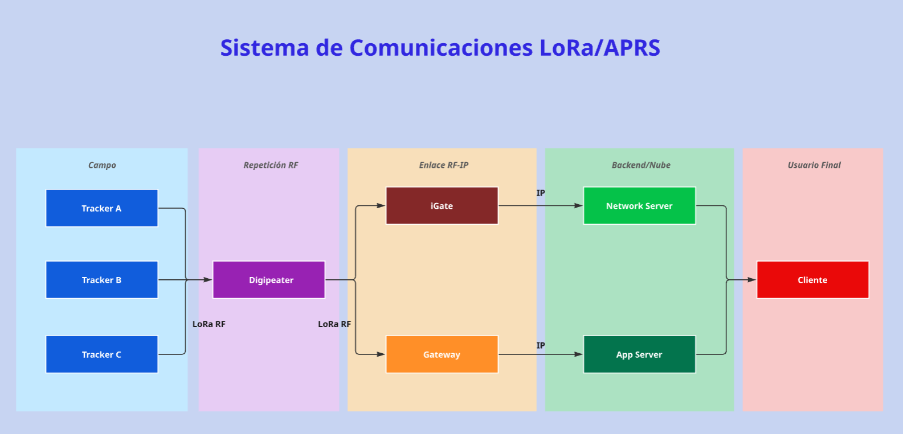
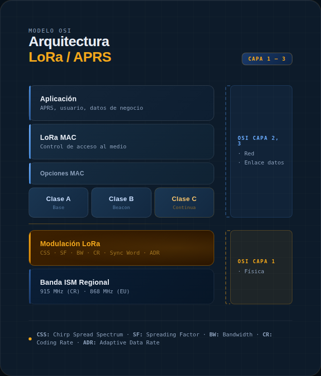

#  Planificación e Investigación del Proyecto
##  Objetivos Específicos

- Diseñar e implementar la arquitectura de un servidor basado en APRS Trackdirect, capaz de recibir y procesar paquetes provenientes de la red APRS-IS y de los módulos tracker del proyecto.

- Configurar y administrar un entorno de servidor seguro que permita el almacenamiento estructurado y la visualización en tiempo real de los datos de geolocalización recibidos.

- Validar la correcta integración del servidor con los dispositivos del sistema, garantizando la recepción, registro y visualización continua de los datos durante la etapa de pruebas y evaluación.
## APRS

### ¿Qué es?

El Automatic Packet Reporting System (APRS) es un sistema de comunicación digital diseñado para radioaficionados que permite transmitir en tiempo real información como posición geográfica, mensajes cortos, telemetría y datos meteorológicos. Fue desarrollado por Bob Bruninga (WB4APR) como una aplicación del protocolo AX.25 sobre radio VHF (Bruninga, 2023; ARRL, 2022).

APRS integra estaciones móviles, repetidoras digitales (digipeaters) y pasarelas a Internet (iGates), conformando una red híbrida de radio e infraestructura IP.

### ¿Para qué sirve? (Aplicaciones)

APRS es un sistema versátil que permite la transmisión automática y periódica de información en redes de radioaficionados. Sus principales aplicaciones incluyen:

- **Seguimiento de estaciones móviles en tiempo real**  
  Permite visualizar la ubicación geográfica de estaciones móviles (vehículos, estaciones portátiles, embarcaciones, bicicletas, etc.) mediante coordenadas obtenidas por GPS.  
  Esta funcionalidad es ampliamente utilizada en eventos, caravanas, actividades al aire libre y monitoreo de flotas experimentales dentro del ámbito de radioafición.

- **Transmisión de telemetría**  
  Facilita el envío de variables técnicas y ambientales como voltaje, corriente, temperatura, humedad, presión atmosférica o estado de sensores remotos.  
  Esto permite supervisar estaciones repetidoras, sistemas solares, nodos remotos o proyectos experimentales de instrumentación.

- **Mensajería digital entre radioaficionados**  
  APRS permite el envío de mensajes cortos tipo texto entre estaciones, incluyendo confirmación de recepción.  
  Esta funcionalidad puede operar tanto por radiofrecuencia directa como a través de la red APRS-IS cuando intervienen iGates.

- **Reportes meteorológicos automáticos**  
  Las estaciones meteorológicas pueden transmitir periódicamente datos como velocidad y dirección del viento, temperatura, lluvia acumulada y presión atmosférica.  
  Estos datos pueden ser compartidos en tiempo real a nivel local o global.

- **Comunicaciones de apoyo en situaciones de emergencia**  
  APRS es especialmente útil cuando la infraestructura celular o de Internet falla.  
  Permite compartir ubicaciones, coordinar recursos y transmitir información básica de estado entre estaciones de radioaficionados, lo cual resulta valioso en escenarios de gestión de desastres y apoyo comunitario (ARRL, 2022).  

### ¿Qué protocolos de comunicación utiliza?

APRS emplea una arquitectura basada en capas, donde cada elemento cumple una función específica dentro del proceso de transmisión de datos:

- **AX.25 (Amateur X.25)**  
  Es el protocolo de enlace de datos utilizado en radioafición. Define la estructura del paquete (frame), el direccionamiento mediante indicativos, los campos de control y el mecanismo de verificación de errores (FCS).  
  En APRS, AX.25 se utiliza en modo sin conexión (UI frames – *Unnumbered Information*), lo que permite transmitir información de manera eficiente sin establecer sesiones formales entre estaciones.

- **AFSK a 1200 baudios en VHF**  
  La modulación más común en APRS es **AFSK (Audio Frequency Shift Keying)** a 1200 bps bajo el estándar Bell 202.  
  En este esquema:
  - 1200 Hz representa el bit lógico “1”  
  - 2200 Hz representa el bit lógico “0”  
  La señal digital se modula como audio y luego se transmite utilizando modulación FM convencional en la banda VHF (típicamente 144–148 MHz). Esto permite que radios FM estándar puedan transportar datos digitales sin hardware especializado adicional.

- **Encapsulamiento sobre IP (APRS-IS)**  
  Cuando los paquetes APRS son recibidos por estaciones llamadas *iGates*, estos se reenvían a través de Internet utilizando el protocolo TCP/IP hacia la red global conocida como APRS-IS (APRS Internet System).  
  En este caso, el contenido del paquete AX.25 se encapsula dentro de tráfico IP, permitiendo la visualización global en servidores y aplicaciones web (Bruninga, 2023).
### ¿En cuáles bandas de frecuencia opera?

En la Región 2 de la Unión Internacional de Telecomunicaciones (América), APRS opera típicamente en:

- 144.390 MHz dentro de la banda 144–148 MHz del Servicio de Radioaficionados (UIT, 2020).

En Costa Rica, la operación debe ajustarse al Plan Nacional de Atribución de Frecuencias (MICITT, 2023).

### Componentes clave de una red APRS

- Transceptor VHF/UHF  
- TNC (Terminal Node Controller)  
- Receptor GPS  
- Digipeaters  
- iGates  
- Servidores APRS-IS  

## LoRa

### ¿Qué es?

LoRa es una tecnología de comunicación inalámbrica desarrollada en 2012 por Cycleo y posteriormente impulsada por Semtech. Utiliza una modulación de espectro ensanchado (Chirp Spread Spectrum – CSS) que permite transmitir datos a largas distancias con bajo consumo de energía y buena tolerancia al ruido, aunque con un ancho de banda reducido.

LoRa corresponde a la modulación de radio utilizada por los dispositivos, mientras que LoRaWAN es el protocolo que define cómo se envían, reciben y gestionan los paquetes de datos dentro de la red.

### Frecuencias que utiliza
LoRa opera en bandas de frecuencia ISM (Industrial, Scientific and Medical) de uso libre, que no requieren pago de licencias. Las frecuencias varían según la región geográfica:
433 MHz — Europa, Asia y América Latina (uso general en bandas ISM).
868 MHz — Europa (banda ISM principal para LoRaWAN en la región EU868).
915 MHz — América del Norte y América Latina (banda US915 / AU915).

**Parámetros técnicos de la modulación:**

Ancho de banda (BW): programable de 100 Hz a 500 kHz (típicamente 125 kHz, 250 kHz o 500 kHz).
Spreading Factor (SF): entre SF7 y SF12. A mayor SF, mayor alcance pero menor velocidad de datos.
Tasa de datos: entre 0.018 kbps y 37.5 kbps en modo LoRa (óptimo para pequeños paquetes de datos de sensores).
Potencia de transmisión: hasta +20 dBm (100 mW).

### Aplicaciones

Gracias a su largo alcance y bajo consumo, LoRa es ideal para proyectos de Internet de las Cosas (IoT) donde los dispositivos transmiten pequeñas cantidades de datos de forma periódica. Sus principales aplicaciones incluyen:

- **Agricultura inteligente:** monitoreo de humedad del suelo, temperatura, sistemas de riego automatizado y control de viñedos o cultivos extensos.

- **Ciudades inteligentes (Smart Cities):** medición de contadores de agua, gas y electricidad a distancia, monitoreo de tráfico y alumbrado público inteligente.

- **Seguimiento y localización de activos:** rastreo de vehículos, mercancías y equipos en grandes superficies o zonas remotas, sin necesidad de GPS.

- **Industria y automatización:** supervisión de maquinaria, control de procesos industriales y monitoreo de fábricas y almacenes.

- **Salud inteligente:** transmisión remota de parámetros fisiológicos (temperatura corporal, presión, pulso) hacia centros médicos.

- **Hogares inteligentes (Smart Home):** control remoto de electrodomésticos, sistemas de seguridad y sensores de puerta o ventana.

- **Redes Meshtastic:** comunicación descentralizada entre nodos sin infraestructura de red fija, útil en situaciones de emergencia o zonas sin cobertura celular.

- **Medición de flujos peatonales (Paxcounter):** conteo de dispositivos WiFi y Bluetooth en espacios públicos para estimar la afluencia de personas.

### Disponibilidad de módulos basados en ESP32 con chip LoRa en el mercado

La combinación del microcontrolador ESP32 (con WiFi y Bluetooth integrados) junto con un chip LoRa ofrece una plataforma de desarrollo versátil y económica para proyectos IoT. Existen diversos módulos disponibles comercialmente:

### LILYGO TTGO LoRa32
- Chip LoRa: SX1276 (versiones anteriores) o SX1262 (versiones recientes).
- Frecuencias disponibles: 433 MHz, 868 MHz y 915 MHz.
- Incluye: pantalla OLED de 0.96", ranura para tarjeta SD, antena SMA y conector para batería de litio.
- Compatible con Arduino IDE, MicroPython y PlatformIO.

### Heltec WiFi LoRa 32 (V3)
- Procesador: ESP32-S3FN8 (dual-core LX7, hasta 240 MHz).
- Chip LoRa: SX1262.
- Incluye: WiFi, Bluetooth BLE y LoRa integrados, pantalla OLED e interfaz USB Type-C con protección ESD.
- Ampliamente utilizado en proyectos Meshtastic y MeshCore.

### LILYGO T-Beam
- Combina ESP32 + chip LoRa (SX1262/SX1276) + módulo GPS integrado.
- Ideal para aplicaciones de rastreo y localización con LoRa.
- Frecuencias: 433 MHz, 868 MHz y 915 MHz.

### Chips LoRa más comunes en estos módulos

- **SX1276 / SX1278 (Semtech):** chips de primera generación, muy populares; soportan frecuencias de 433 MHz y 915 MHz respectivamente.
- **SX1262 (Semtech):** chip de segunda generación con mejor sensibilidad (hasta -148 dBm), menor consumo y mayor eficiencia; recomendado para proyectos nuevos.

### Arquitectura de red LoRa/APRS

Un sistema de comunicaciones LoRa/APRS integra la modulación de largo alcance LoRa como medio de transmisión con el protocolo APRS (Automatic Packet Reporting System) para el envío de información. Los paquetes APRS se transmiten por radiofrecuencia utilizando modulación LoRa y posteriormente llegan a la red global APRS-IS a través de los iGates.  

La arquitectura sigue una topología en estrella de estrellas donde el flujo es:

### 1. Nodo / Tracker APRS

El nodo es el elemento más básico de la red. Es el dispositivo de campo que captura datos del entorno (mediante sensores) o ejecuta acciones (mediante actuadores), y los transmite de forma inalámbrica usando la modulación LoRa.

**Hardware típico**
- ESP32  
- Chip LoRa (SX1276 / SX1262)  
- Módulo GPS (NEO-6M / NEO-M8N)  
- Antena

**Trama APRS**
Formato estandarizado que incluye:
- callsign
- ruta WIDE
- símbolo
- posición
- datos opcionales

**Clases LoRaWAN**
- Clase A: bajo consumo, ventanas RX después de TX  
- Clase B: recepción sincronizada mediante balizas  
- Clase C: recepción continua

**Frecuencia de baliza**
Configurable; típicamente entre **1 y 5 minutos** según la velocidad del vehículo.

### 2. Digipeater (Repetidor Digital RF)

El digipeater es un repetidor digital que opera únicamente en radiofrecuencia, sin necesidad de conexión a Internet. Recibe un paquete APRS transmitido por un nodo y lo retransmite por RF, extendiendo el alcance de la red en zonas donde los nodos no tienen cobertura directa hacia un iGate. El mecanismo de rutas WIDE controla cuántos saltos puede dar un paquete.

**Rutas WIDE**
- WIDE1-1: primer salto por digipeaters locales de bajo nivel.  
- WIDE2-1: segundo salto por digipeaters de mayor cobertura.

**Cache anti-duplicado**
Evita retransmitir el mismo paquete más de una vez dentro de un periodo de tiempo.

**Características**
- Opera completamente offline.  
- No requiere WiFi, Ethernet ni SIM card.  
- Se puede implementar con ESP32 + LoRa usando firmware como CA2RXU, DL9SAU u otros.

### 3. iGate (Internet Gateway APRS)

El iGate es el componente que conecta la red de radiofrecuencia LoRa con la red global APRS-IS en Internet. Recibe paquetes APRS por RF y los envía a un servidor APRS-IS mediante una conexión TCP/IP. De esta forma, los trackers pasan a ser visibles en servicios como APRS.fi.

**Modos de operación**

- **iGate RX-only:** recibe paquetes por RF y los publica en APRS-IS. Es el modo más simple.  
- **iGate RX+TX:** además de recibir, puede enviar mensajes y ACKs desde Internet hacia los nodos por RF.  
- **iGate + Digipeater:** combina ambas funciones; retransmite paquetes por RF y los envía a Internet al mismo tiempo.

**Requisitos**

- Callsign de radioaficionado  
- Credenciales APRS-IS (passcode)

**Hardware típico**

- ESP32  
- Chip LoRa  
- Conectividad a Internet (WiFi o Ethernet)

**Firmware común**

- CA2RXU LoRa iGate  
- aprx  
- Direwolf

### 4. Gateway LoRa (Concentrador LoRaWAN)

El gateway LoRa es un concentrador de infraestructura capaz de recibir múltiples canales de comunicación simultáneamente (8 o más). A diferencia del iGate (que usa firmware APRS y normalmente opera en un solo canal), un gateway LoRaWAN utiliza un chip concentrador como el SX1302 o SX1303 y reenvía los paquetes recibidos al servidor de red (LNS) mediante el protocolo Packet Forwarder de Semtech.

**Características principales**

- **Chip concentrador:** SX1302 o SX1303, capaz de recibir hasta 8 canales LoRa simultáneamente.  
- **Procesador host:** Raspberry Pi, módulos iMX8 u otros sistemas embebidos con Linux.  
- **Conectividad:** Ethernet, WiFi, 4G/LTE o enlace satelital.  
- **Comunicación con el servidor:** reenvía paquetes al LNS mediante UDP usando el protocolo Semtech Packet Forwarder.

  ### 5. Servidor (APRS-IS / TrackDirect / LNS)

En un sistema LoRa/APRS el servidor cumple varias funciones según su rol. El servidor APRS-IS es una red global de servidores interconectados que distribuye los paquetes APRS recibidos por los iGates de todo el mundo. Por otro lado, TrackDirect es una instancia local que recibe, almacena y visualiza los paquetes en un mapa web.

**Componentes principales**

- **APRS-IS Collector:** recibe paquetes TCP en el puerto 14580 desde los iGates.  
- **Parser APRS:** decodifica las tramas y extrae información como posición, velocidad, callsign y telemetría.  
- **Base de datos PostgreSQL:** almacena el historial completo de posiciones y paquetes.  
- **WebSocket Server:** envía actualizaciones en tiempo real al frontend del mapa.  
- **API REST:** proporciona endpoints como `/api/stations` y `/api/packets` para acceso externo.  
- **Frontend Web:** interfaz basada en LeafletJS con mapas de OpenStreetMap para visualizar estaciones y trayectorias.

### 6. Cliente Final (Visualización y Consumo de Datos)

El cliente final es cualquier usuario, aplicación o sistema que consume los datos APRS procesados por el servidor. 

**Opciones de visualización y consumo**

- **APRS.fi:** mapa mundial en tiempo real, historial de trayectorias y gráficas de telemetría.  
- **aprsdirect.de / aprs.direct:** servidores alternativos con visualización en mapa y filtros por callsign.  
- **Servidor TrackDirect local:** instancia propia del grupo con visualización personalizada.  
- **API REST / MQTT:** acceso programático a los datos para integración con otros sistemas.  
- **Exportación de datos:** descarga en formatos CSV, JSON o KML para análisis posterior.

##  Modelo OSI en LoRa / APRS

LoRa actúa como tecnología de capa 1 (Física), mientras que LoRaWAN o los protocolos APRS implementan la capa 2 (Enlace de Datos). A continuación se presenta cómo se mapean:

###  Tabla Modelo OSI LoRa/APRS 

| Capa OSI | Nombre | Implementación en LoRa/APRS |
|----------|--------|-----------------------------|
| Capa 1 | Física | Modulación LoRa (CSS): Spreading Factor, Bandwidth, Coding Rate, Sync Word |
| Capa 2 | Enlace de Datos | Tramas AX.25 encapsuladas en LoRa, ADR, control de errores CRC |
| Capa 3+ | Red / Superior | APRS-IS, TCP/IP hacia Internet (iGate), servidor TrackDirect |

## 1. Spreading Factor (SF)

El **Spreading Factor (Factor de Dispersión)** es el parámetro más influyente de la modulación LoRa (**Chirp Spread Spectrum - CSS**). Determina cuántos *chips* se utilizan para representar un símbolo de datos.

### 1.1 Definición técnica

El SF puede tomar valores entre **SF7 y SF12**. Cada incremento en el SF **duplica el tiempo en el aire (Time on Air - ToA)** y **aumenta la sensibilidad del receptor en aproximadamente 2.5 dB**, a costa de **reducir a la mitad la tasa de datos efectiva**.

### 1.2 Tabla comparativa de SF

| SF | Chips/Símbolo | Sensibilidad (dBm) | Tasa de Datos* (bps) | Tiempo en Aire* | Alcance típico |
|----|---------------|--------------------|----------------------|-----------------|---------------|
| SF7 | 128 | -123 | ~5470 | ~56 ms | Corto (~2 km) |
| SF8 | 256 | -126 | ~3125 | ~103 ms | Medio (~4 km) |
| SF9 | 512 | -129 | ~1758 | ~185 ms | Medio (~6 km) |
| SF10 | 1024 | -132 | ~977 | ~370 ms | Largo (~8 km) |
| SF11 | 2048 | -134.5 | ~537 | ~741 ms | Muy largo (~11 km) |
| SF12 | 4096 | -137 | ~293 | ~1400 ms | Máximo (~14 km) |

### 1.3 Selección para LoRa/APRS

Para redes **APRS con LoRa en Costa Rica**, los valores más utilizados son **SF9 a SF12**, dependiendo del entorno:

- **SF9 – SF10:** Zonas urbanas y semi-urbanas con buena densidad de *iGates*.  
- **SF11 – SF12:** Zonas rurales y montañosas como el área del **Volcán Irazú** o **Zona Norte**, donde se requiere máximo alcance.

## 2. Bandwidth (BW) — Ancho de Banda

El **Bandwidth (BW)** define el rango de frecuencias utilizado en la transmisión LoRa. Es el **ancho del chirp en el dominio de la frecuencia**, expresado en **kHz**.

### 2.1 Valores disponibles

Los chips LoRa soportan los siguientes valores de ancho de banda:

| BW (kHz) | Tasa de Datos | Robustez ante interferencias | Uso típico |
|----------|---------------|-------------------------------|------------|
| 125 kHz  | Baja–Media    | Alta (más resistente)        | LoRaWAN estándar, APRS LoRa |
| 250 kHz  | Media–Alta    | Media                         | Aplicaciones de mayor throughput |
| 500 kHz  | Alta          | Baja                          | Comunicación de corto alcance |

### 2.2 Relación con otros parámetros

El **BW** está directamente relacionado con el **Spreading Factor (SF)** y la **sensibilidad del receptor**:

- **Menor BW →** Mayor sensibilidad y alcance, pero menor velocidad de transmisión.
- **Mayor BW →** Mayor velocidad de datos, pero menor alcance y mayor susceptibilidad al ruido.

Duplicar el **BW** reduce la **sensibilidad del receptor en aproximadamente 3 dB**.

## 3. Coding Rate (CR) — Tasa de Codificación

El **Coding Rate (CR)** define el nivel de **redundancia añadida a los datos** mediante codificación de **corrección de errores** (*Forward Error Correction – FEC*).  
Esta redundancia permite que el receptor pueda **detectar y corregir errores causados por ruido o interferencias** durante la transmisión.

En LoRa se utiliza un esquema de **codificación Hamming de tasa variable**, donde se agregan bits extra de corrección a los datos originales.

## 4. Sync Word - Palabra de sincrinización

El Sync Word es un byte (o secuencia de bytes) que identifica la red LoRa. Permite que múltiples redes LoRa coexistan en el mismo canal de frecuencia sin interferirse mutuamente, funcionando como un identificador de red en la capa física.

### 4.1 Funcionamiento

Cuando un receptor LoRa detecta una trama entrante, compara el Sync Word recibido con el configurado localmente. Si no coinciden, la trama es descartada sin procesarla, evitando colisiones entre redes distintas.

## 5. ADR — Adaptive Data Rate (Tasa de Datos Adaptativa)

ADR (Adaptive Data Rate) es un mecanismo de la capa de enlace que permite al servidor de red ajustar dinámicamente los parámetros de transmisión de cada nodo (SF, BW y potencia de transmisión) para optimizar el consumo energético y el uso del espectro radioeléctrico.

### 5.1 Principio de funcionamiento

El servidor de red monitorea la calidad de enlace (SNR – Signal to Noise Ratio) de los mensajes recibidos de cada nodo. Basándose en el historial de SNR, decide si es posible usar parámetros menos costosos (menor SF, mayor tasa de datos) manteniendo la confiabilidad de la comunicación.

# Legislación Costarricense

## Cuadro Nacional de Atribución de Frecuencias (PNAF)

El uso del espectro radioeléctrico en Costa Rica está regulado por el Decreto Ejecutivo N° 44010-MICITT, publicado en el Alcance N° 99 a La Gaceta N° 95 del 30 de mayo de 2023.

Este decreto:

- Actualiza el Plan Nacional de Atribución de Frecuencias.  
- Define la atribución primaria o secundaria de cada banda.  
- Establece condiciones técnicas generales de operación.  
- Armoniza el cuadro nacional con el Reglamento de Radiocomunicaciones de la UIT (MICITT, 2023).  

## Permisos requeridos para operar un sistema LoRa/APRS

### Para APRS (Servicio de Radioaficionados)

- Licencia de radioaficionado vigente.  
- Indicativo oficialmente asignado.  
- Cumplimiento de límites de potencia y clase de emisión.  

### Para LoRa (banda ISM 902–928 MHz)

- Cumplimiento de normativa técnica para dispositivos de corto alcance.  
- Respeto de límites de Potencia Isotrópica Radiada Equivalente (PIRE).  

### Trámites generales

1. Presentación de solicitud formal ante la autoridad competente.  
2. Evaluación técnica.  
3. Pago de derechos administrativos (según aplique).  
4. Emisión de resolución y autorización correspondiente.  

Tiempo estimado:
- Revisión documental: 1–2 semanas.  
- Evaluación técnica: 2–4 semanas.  
- Resolución final: variable según carga administrativa.  

## Clases de Emisión (Modulación)

Las clases de emisión describen el tipo de modulación y la naturaleza de la señal transmitida (UIT, 2020).

- F2D: Frecuencia modulada con transmisión de datos digitales (APRS tradicional).  
- Chirp Spread Spectrum (CSS): Modulación utilizada en sistemas LoRa.  

## Bandas de Frecuencia en Costa Rica para LoRa/APRS

Según el PNAF (MICITT, 2023):

- 144–148 MHz → Servicio de Radioaficionados (APRS VHF).  
- 902–928 MHz → Banda ISM para aplicaciones LoRa de baja potencia.  

La operación debe ajustarse a la atribución oficial y condiciones técnicas vigentes.

## PIRE permitida

- Servicio de Radioaficionados (144–148 MHz): límites definidos por reglamentación nacional.  
- Banda ISM 902–928 MHz: límites específicos para dispositivos de corto alcance establecidos por normativa técnica nacional.  

Los valores exactos deben verificarse en la regulación vigente emitida por la autoridad competente (MICITT, 2023; UIT, 2020).

# Bibliografía

ARRL. (2022). APRS Overview and Operating Guide. American Radio Relay League.  

Bruninga, B. (2023). APRS Protocol Reference.  

Ministerio de Ciencia, Innovación, Tecnología y Telecomunicaciones (MICITT). (2023). Decreto Ejecutivo N° 44010-MICITT: Plan Nacional de Atribución de Frecuencias. Alcance N° 99 a La Gaceta N° 95, 30 de mayo de 2023.  

Unión Internacional de Telecomunicaciones (UIT). (2020). Reglamento de Radiocomunicaciones.

Leverege. (2016). LoRa & LoRaWAN Primer.

Semtech Corporation. (2024). LoRa and LoRaWAN: A Technical Overview (AN1200.86).
