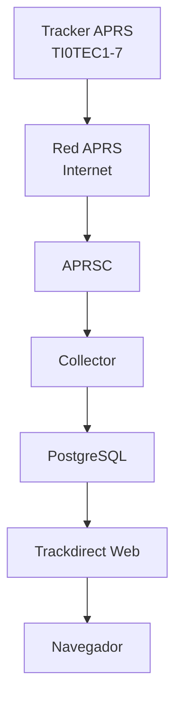
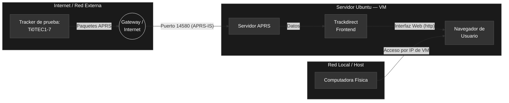
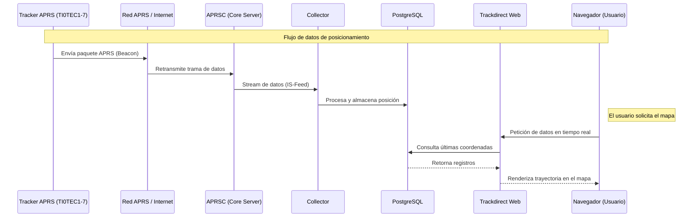
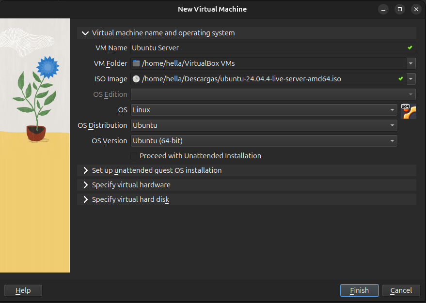
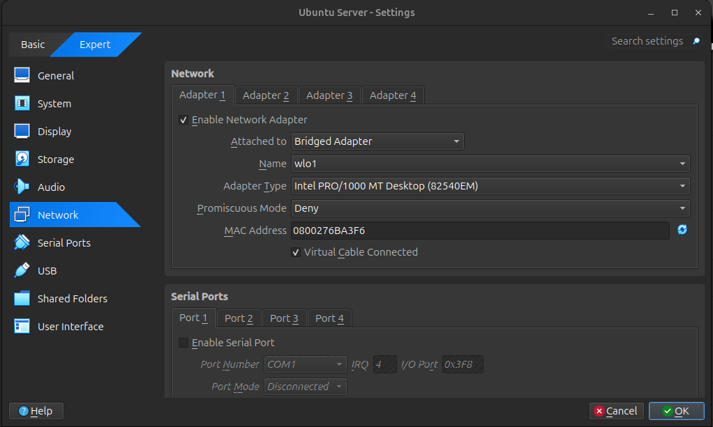
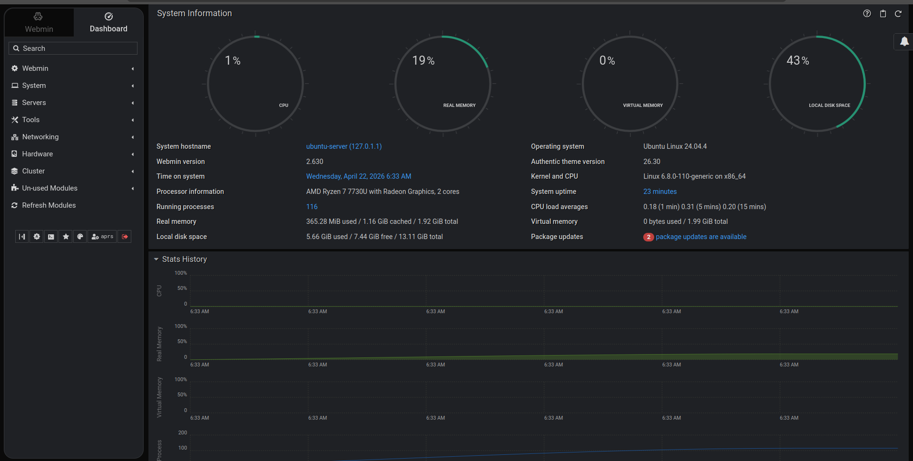
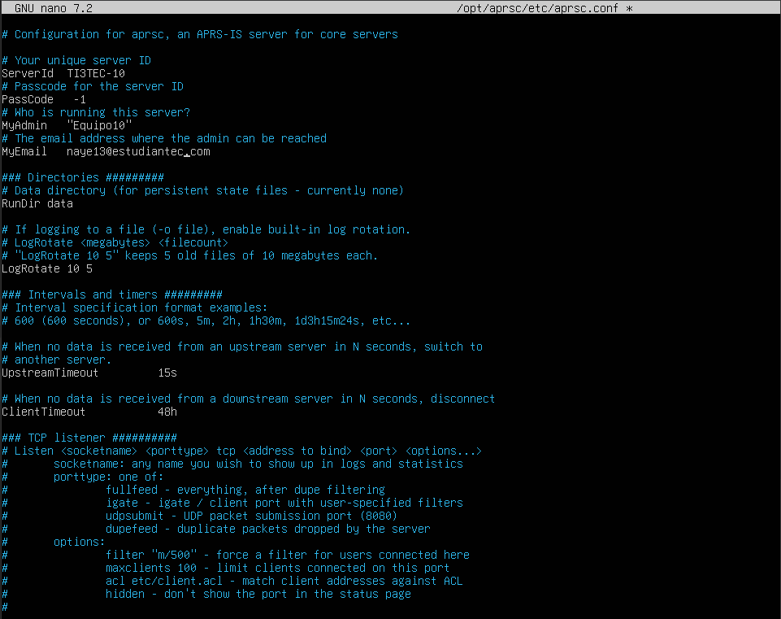
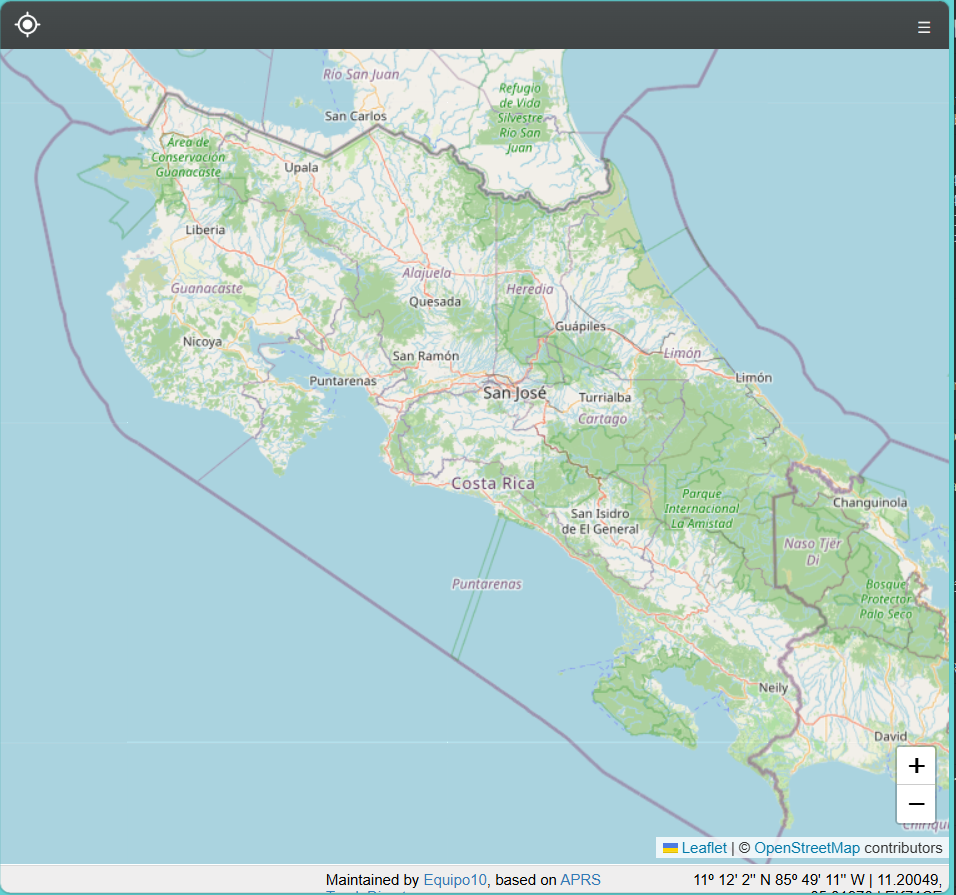
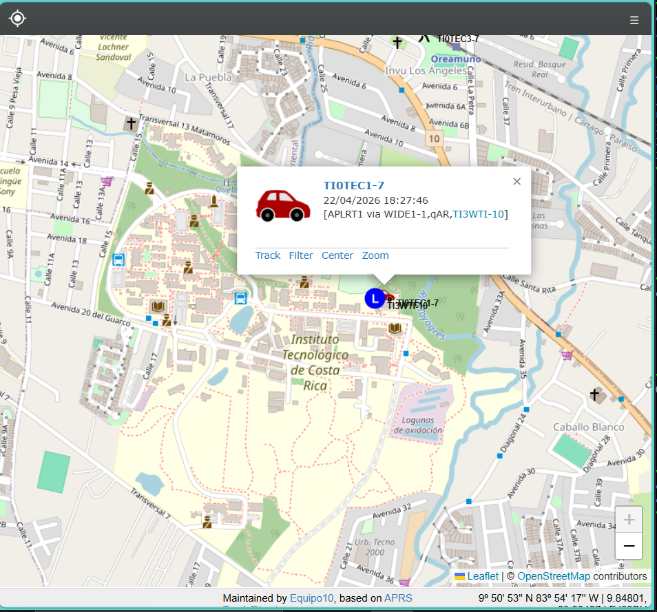

# __Servidor APRS__

APRS (Automatic Packet Reporting System) es un protocolo de comunicación digital desarrollado por Bob Bruninga que permite la transmisión en tiempo real de información de posicionamiento, telemetría y mensajes cortos a través de redes de radioaficionados.

En este proyecto se plantea desplegar un servidor APRS-IS institucional capaz de recibir, almacenar y visualizar paquetes generados por distintos trackers. Este servidor constituye la pieza central de la infraestructura de red del sistema.

# Justificacion Tecnica

## Ubuntu Server 22.04 LTS
Proporciona estabilidad, soporte extendido y facilidad de gestión de paquetes mediante *apt*.

## VirtualBox
Permite aislamiento del entorno, snapshots y conectividad mediante modo puente.

## Webmin
Facilita la administración gráfica del servidor Linux.

## aprsc
Servidor APRS-IS de alto rendimiento escrito en C, optimizado para concurrencia.

## trackdirect
Frontend web basado en WebSockets para visualización en tiempo real.


# Diagramas de la Arquitectura del sistema

El siguiente diagrama de bloques representa el flujo completo del sistema:


## Arquitectura de Red APRS

El siguiente diagrama muestra la arquitectura de red APRS:



En el diagrama se presenta la arquitectura de red correspondiente al servidor APRS, organizada en tres bloques principales. El primero representa la red externa o Internet; el segundo, el servidor Ubuntu desplegado en una máquina virtual mediante VirtualBox; y el tercero, la red local o equipo anfitrión.

En el bloque de la red externa se identifica un *tracker* de prueba, denominado TI0TEC1-7, encargado de generar paquetes APRS que contienen información como la posición GPS. Estos datos son enviados hacia un *gateway* de Internet, el cual actúa como intermediario para su transmisión a través de la red.

Posteriormente, los paquetes ingresan al sistema a través del puerto 14580, correspondiente al puerto estándar utilizado por el servicio APRS para la recepción de información desde la red global.

El segundo bloque, asociado al servidor Ubuntu en la máquina virtual, constituye el núcleo del sistema. En este entorno se ejecuta el servidor APRS, encargado de recibir los datos provenientes de Internet, procesarlos y ponerlos a disposición de otros servicios internos. A partir de este punto, la información es transferida al componente Trackdirect, que funciona como interfaz de visualización. Este permite representar los datos en forma de mapas y trayectorias, facilitando su interpretación.

Asimismo, dentro de este bloque se contempla el acceso mediante un navegador web, el cual utiliza el protocolo HTTP para interactuar con la interfaz de usuario. Esto posibilita la visualización en tiempo real de la información procesada.

Finalmente, el tercer bloque corresponde a la red local o equipo anfitrión, es decir, la computadora física desde la cual se accede al sistema. La comunicación se establece mediante la dirección IP de la máquina virtual, lo que permite la interacción con el servidor y la visualización de los datos en un entorno local.

## Secuencia APRS

El siguiente diagrama muestra el diagrama de secuencias de la red APRS




Este diagrama de secuencia del sistema APRS, el cual describe el flujo de datos desde la generación de los paquetes de posicionamiento hasta su visualización en el navegador del usuario. El proceso se divide en dos fases principales: la fase de ingesta de datos y la fase de visualización.

- __Fase de Ingesta de Datos__

El flujo inicia con el _tracker_ APRS TI0TEC1-7, el cual envía periódicamente paquetes de tipo _beacon_ que contienen información de posicionamiento. Estos paquetes son transmitidos mediante radiofrecuencia hacia la red APRS.

Posteriormente, la red APRS, a través de un _iGate_, retransmite las tramas de datos hacia el servidor APRSC mediante una conexión TCP. El servidor APRSC actúa como núcleo del sistema, recibiendo las tramas y distribuyéndolas a través de un flujo interno conocido como _IS-Feed_.

El proceso collector se encuentra suscrito a este flujo de datos, permitiendo la recepción continua de paquetes APRS. Una vez recibidos, el collector procesa la información relevante, como coordenadas geográficas y marcas de tiempo, y la almacena en la base de datos PostgreSQL.

- __Fase de Visualización__

En la segunda fase, el usuario interactúa con el sistema a través de un navegador web. Al acceder a la aplicación Trackdirect Web, el navegador envía una petición de datos en tiempo real.

El servidor web recibe la solicitud y realiza una consulta a la base de datos PostgreSQL para obtener las últimas coordenadas registradas del tracker. La base de datos responde con los registros solicitados, los cuales son procesados por el servidor web.

Finalmente, Trackdirect Web envía la información al navegador del usuario, donde se renderiza la trayectoria del tracker sobre un mapa interactivo, permitiendo la visualización en tiempo real de la posición.


# Configuración de Servidor: VirtualBox + Ubuntu Server + Webmin + Servidor APRS


---

# 1. Creación del Entorno Virtual

## Máquina virtual

* Nombre: `Integrador`
* Tipo: Linux
* Versión: Ubuntu (64-bit)

## Recursos

| Recurso | Valor                |
| ------- | -------------------- |
| RAM     | 2 GB mínimo          |
| CPU     | 2 núcleos            |
| Disco   | 20 GB (VDI dinámico) |


---

## 2. Configuración de Red

```
NAT ❌ → Adaptador puente (Bridge Adapter) ✅
```

Permite acceso desde el host y conexión con otros dispositivos (como el iGate).

---

# 3. Instalación de Ubuntu Server

Durante la instalación:

* Idioma y teclado
* Red automática (DHCP)
* Uso completo del disco
* Creación de usuario

### Activar SSH

```bash
Install OpenSSH server
```

---

## 4. Verificar IP del servidor

```bash
ip a
```

Ejemplo:

```
192.168.0.23
```

---

# 5. Instalación de Webmin

## Actualizar sistema

```bash
sudo apt update
sudo apt upgrade -y
```

## Dependencias

```bash
sudo apt install -y wget apt-transport-https software-properties-common
```

## Descargar e instalar

```bash
wget https://www.webmin.com/download/deb/webmin-current.deb
sudo apt install -y ./webmin-current.deb
```

Si hay errores:

```bash
sudo apt --fix-broken install -y
```

## Abrir puerto

```bash
sudo ufw allow 10000
```

## Acceso

```
https://IP_DEL_SERVIDOR:10000
```

---

# 6. Instalación de APRS (aprsc)

## Requisitos Previos

* Ubuntu Server funcionando
* Webmin instalado
* Conexión a internet
* Usuario con sudo

---

## 1. Actualizar e instalar dependencias

```bash
sudo apt update && sudo apt upgrade -y
sudo apt install -y build-essential libc6-dev libssl-dev zlib1g-dev git libevent-dev
```

---

## 2. Clonar repositorio

```bash
cd ~
git clone https://github.com/hessu/aprsc.git
cd aprsc/src
```

---

## 3. Corregir compatibilidad con GCC moderno

El archivo `hlog.c` contiene una llamada incompatible con versiones modernas de GCC:

```bash
nano hlog.c
```

Buscar con **Ctrl + W**:

```c
pthread_setname_np(name);
```

Reemplazar por:

```c
pthread_setname_np(pthread_self(), name);
```

Guardar con **Ctrl + O** y salir con **Ctrl + X**.

---

## 4. Compilar e instalar

```bash
./configure
make
sudo make install
```

Instalación en `/opt/aprsc/`.

---

## 5. Crear usuario y directorios

```bash
sudo useradd -r -s /bin/false aprsc
sudo mkdir -p /opt/aprsc/logs
sudo mkdir -p /opt/aprsc/data
sudo chown -R aprsc:aprsc /opt/aprsc
sudo chmod 644 /opt/aprsc/etc/aprsc.conf
```

---

# 7. Configuración de aprsc

## Editar configuración

```bash
sudo nano /opt/aprsc/etc/aprsc.conf
```

### Parámetros a modificar:

```conf
ServerId        TI0TEC-10
PassCode        12429

MyAdmin         "Equipo10, TEC"
MyEmail         tucorreo@estudiantec.cr

RunDir          /opt/aprsc/data

Listen "Full feed"              fullfeed  tcp  ::  10152
Listen "Client-Defined Filters" igate     tcp  ::  14580
Listen "UDP submit"             udpsubmit udp  ::  8080

Uplink "Core rotate" full tcp rotate.aprs.net 10152

HTTPStatus 0.0.0.0 14501
```

> **Importante:** Eliminar la línea `MagicBadness 42.7` del archivo.

> **Nota sobre el PassCode:** El passcode se genera a partir del callsign (sin SSID) usando una página generadora como https://apps.magicbug.co.uk/passcode/ ingresando el callsign **TI0TEC** (con cero, no letra o).

---

# 8. Configuración como servicio (systemd)

## Crear servicio

```bash
sudo nano /etc/systemd/system/aprsc.service
```

### Contenido:

```ini
[Unit]
Description=aprsc APRS-IS Server
After=network.target

[Service]
Type=simple
ExecStart=/opt/aprsc/sbin/aprsc -u aprsc -c /opt/aprsc/etc/aprsc.conf -r /opt/aprsc/logs
Restart=on-failure

[Install]
WantedBy=multi-user.target
```

## Activar servicio

```bash
sudo systemctl daemon-reload
sudo systemctl enable aprsc
sudo systemctl start aprsc
```

---

# 9. Verificación de aprsc

## Estado del servicio

```bash
sudo systemctl status aprsc
```

## Puertos activos

```bash
ss -tlnp | grep -E "10152|14580"
```

## Monitoreo HTTP

```
http://IP_DEL_SERVIDOR:14501/status.json
```

## Logs en tiempo real

```bash
sudo journalctl -f -u aprsc
```

---

# 10. Instalación y Configuración de trackdirect

## 1. Clonar el repositorio

```bash
cd ~
git clone https://github.com/qvarforth/trackdirect.git
cd trackdirect
```

## 2. Instalar PostgreSQL

```bash
sudo apt install -y postgresql postgresql-client-common postgresql-client
```

## 3. Instalar otras dependencias del sistema

```bash
sudo apt install -y sudo git libpq-dev libevent-dev libmagickwand-dev imagemagick inkscape
```

## 4. Instalar Python3 y paquetes requeridos

```bash
sudo apt install -y python3 python3-dev python3-pip python-is-python3 python3-full python3-psycopg2 python3-setuptools python3-autobahn python3-twisted python3-jsmin python3-psutil
```

## 5. Instalar PHP y paquetes requeridos

```bash
sudo apt install -y php libapache2-mod-php php-dom php-pgsql php-imagick php-dev php-pear php-gd
```

## 6. Instalar librería APRS de Python

```bash
cd /opt
sudo git clone https://github.com/rossengeorgiev/aprs-python
cd aprs-python
sudo python3 setup.py install
```

## 7. Instalar la función heatmap

```bash
cd /opt
sudo wget http://jjguy.com/heatmap/heatmap-2.2.1.tar.gz
sudo tar xzf heatmap-2.2.1.tar.gz
cd heatmap-2.2.1
```

Corregir error en `setup.py`:

```bash
sudo nano setup.py
```

Cambiar:
```python
print 'On Windows, skipping build_ext.'
```
Por:
```python
print('On Windows, skipping build_ext.')
```

Corregir error en `__init__.py`:

```bash
sudo nano /usr/local/lib/python3.12/dist-packages/heatmap/__init__.py
```

Cambiar:
```python
except Exception, e:
```
Por:
```python
except Exception as e:
```

Instalar:

```bash
sudo python3 setup.py install
```

---

## 8. Configurar la base de datos PostgreSQL

```bash
sudo -u postgres psql -c "CREATE USER trackdirect WITH PASSWORD 'trackdirect';"
sudo -u postgres psql -c "CREATE DATABASE trackdirect OWNER trackdirect;"
```

Crear las tablas:

```bash
cd /opt/trackdirect/server/scripts
sudo -u postgres ./db_setup.sh trackdirect 5432 /opt/trackdirect/misc/database/tables/
```

Asignar permisos y propietario al usuario trackdirect sobre todas las tablas:

```bash
sudo -u postgres psql -d trackdirect -c "
DO \$\$
DECLARE
    r RECORD;
BEGIN
    FOR r IN SELECT tablename FROM pg_tables WHERE schemaname = 'public'
    LOOP
        EXECUTE 'ALTER TABLE ' || r.tablename || ' OWNER TO trackdirect';
    END LOOP;
END\$\$;
"
```

```bash
sudo -u postgres psql -d trackdirect -c "GRANT ALL PRIVILEGES ON ALL TABLES IN SCHEMA public TO trackdirect;"
sudo -u postgres psql -d trackdirect -c "GRANT ALL PRIVILEGES ON ALL SEQUENCES IN SCHEMA public TO trackdirect;"
```

---

## 9. Configurar Apache

```bash
sudo mkdir -p /var/www/trackdirect/config
sudo cp -r /opt/trackdirect/htdocs /var/www/trackdirect
sudo cp /opt/trackdirect/config/trackdirect.ini /var/www/trackdirect/config
sudo chmod 777 /var/www/trackdirect/htdocs/public/symbols
sudo chmod 777 /var/www/trackdirect/htdocs/public/heatmaps
sudo chown -R www-data:www-data /var/www
```

Editar configuración de Apache:

```bash
sudo nano /etc/apache2/sites-available/000-default.conf
```

Contenido:

```apache
<VirtualHost *:80>
    ServerAdmin webmaster@localhost
    DocumentRoot /var/www/trackdirect/htdocs/public
    ErrorLog ${APACHE_LOG_DIR}/aprs-error.log
    CustomLog ${APACHE_LOG_DIR}/aprs-access.log combined
    <Directory "/var/www/trackdirect/htdocs/public">
        Options Indexes MultiViews SymLinksIfOwnerMatch
        AllowOverride All
        Require all granted
    </Directory>
</VirtualHost>
```

Activar módulos y reiniciar Apache:

```bash
sudo a2enmod rewrite
sudo a2enmod proxy
sudo a2enmod proxy_http
sudo a2enmod proxy_wstunnel
sudo service apache2 restart
```

---

## 10. Editar archivo de configuración de trackdirect

```bash
nano ~/trackdirect/config/trackdirect.ini
```

**Sección `[website]`:**
```ini
owner_name="Equipo10"
owner_email="tucorreo@estudiantec.cr"
websocket_url="ws://IP_DEL_SERVIDOR:8091"
```

**Sección `[database]`:**
```ini
host="127.0.0.1"
database="trackdirect"
username="trackdirect"
password="trackdirect"
port="5432"
```

**Sección `[collector0]`:**
```ini
host="127.0.0.1"
port_full="10152"
port_filtered="14580"
```

**Sección `[websocket_server]`:**
```ini
host="0.0.0.0"
port="8091"
external_port="8091"
```

**Sección de conexión con aprsc:**
```ini
aprs_host1="127.0.0.1"
aprs_port1="14580"
aprs_source_id1="1"
```

> **Nota:** El puerto del websocket se configura en **8091** porque aprsc ocupa el puerto 8090.

También editar el archivo de Apache con los mismos parámetros de `[website]` y `[database]`:

```bash
sudo nano /var/www/trackdirect/config/trackdirect.ini
```

---

## 11. Crear tabla de paquetes del día actual

trackdirect crea tablas con la fecha del día. Crearla manualmente la primera vez:

```bash
sudo -u postgres psql -d trackdirect -c "CREATE TABLE IF NOT EXISTS packet$(date +%Y%m%d) () INHERITS (packet);"
sudo -u postgres psql -d trackdirect -c "GRANT ALL PRIVILEGES ON ALL TABLES IN SCHEMA public TO trackdirect;"
```

---

## 12. Iniciar servicios de trackdirect

### Collector

```bash
PYTHONPATH=/home/vboxuser/trackdirect/server/trackdirect:/home/vboxuser/trackdirect/server:/home/vboxuser/trackdirect python3 /home/vboxuser/trackdirect/server/bin/collector.py /home/vboxuser/trackdirect/config/trackdirect.ini 0 > /tmp/collector.log 2>&1 &
```

### Websocket server

```bash
PYTHONPATH=/home/vboxuser/trackdirect/server/trackdirect:/home/vboxuser/trackdirect/server:/home/vboxuser/trackdirect python3 /home/vboxuser/trackdirect/server/bin/wsserver.py --config /home/vboxuser/trackdirect/config/trackdirect.ini > /tmp/wsserver.log 2>&1 &
```

### Remover

```bash
cd ~/trackdirect/server/scripts
bash remover.sh trackdirect.ini &
```

---

## 13. Configurar crontab para inicio automático

```bash
crontab -e
```

Agregar al final:

```
* * * * * PYTHONPATH=/home/vboxuser/trackdirect/server/trackdirect:/home/vboxuser/trackdirect/server:/home/vboxuser/trackdirect python3 /home/vboxuser/trackdirect/server/bin/collector.py /home/vboxuser/trackdirect/config/trackdirect.ini 0 2>&1 &
* * * * * PYTHONPATH=/home/vboxuser/trackdirect/server/trackdirect:/home/vboxuser/trackdirect/server:/home/vboxuser/trackdirect python3 /home/vboxuser/trackdirect/server/bin/wsserver.py --config /home/vboxuser/trackdirect/config/trackdirect.ini >> /tmp/wsserver.log 2>&1 &
* * * * * ~/trackdirect/server/scripts/remover.sh trackdirect.ini 2>&1 &
*/30 * * * * ~/trackdirect/server/scripts/ogn_devices_install.sh trackdirect 5432 2>&1 &
```

---

# 11. Verificación Final

## Acceder al mapa

```
http://IP_DEL_SERVIDOR
```

## Verificar paquetes recibidos

```bash
sudo -u postgres psql -d trackdirect -c "SELECT COUNT(*) FROM packet;"
```

## Buscar tracker específico

```
http://IP_DEL_SERVIDOR/?call=TI0TEC1-7&center=9.855,-83.907&zoom=12
```



## Puertos Utilizados

| Puerto | Protocolo | Uso |
|--------|-----------|-----|
| 10152 | TCP | Full feed APRS-IS |
| 14580 | TCP/UDP | Clientes e iGates |
| 8080 | UDP | UDP submit (aprsc) |
| 8090 | TCP | Ocupado por aprsc |
| 8091 | TCP | Websocket trackdirect |
| 14501 | HTTP | Panel de monitoreo aprsc |
| 80 | HTTP | Interfaz web trackdirect |
| 10000 | HTTPS | Webmin |

