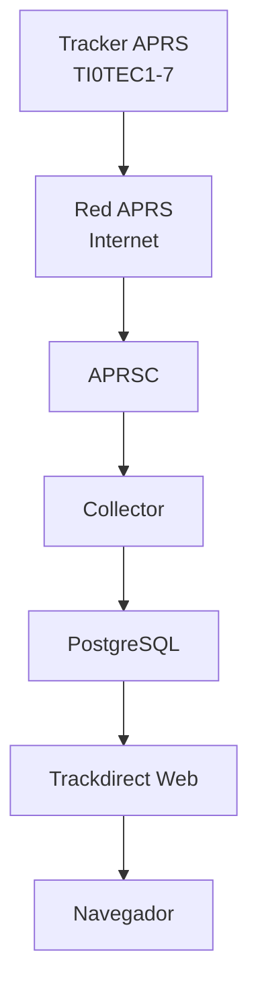

### Tecnológico de Costa Rica
Escuela de Ingeniería Electrónica  
EL5610 Taller Integrador  
Nayelhi Guillen Garcia  
Katherine Salazar Martinez  
Grupo 10  
I Semestre 2026

---

# Servidor APRS

Este repositorio contiene la implementación de un servidor APRS (Automatic Packet Reporting System), desarrollado como parte de un proyecto académico enfocado en la recepción, procesamiento y visualización de datos de telemetría en tiempo real.

El servidor está basado en la herramienta **aprsc**, desplegada sobre un entorno virtualizado con Ubuntu Server, y tiene como objetivo principal actuar como nodo central para la recepción de paquetes provenientes de estaciones iGate y dispositivos tracker. Estos datos son posteriormente procesados y pueden ser visualizados mediante una interfaz web.

Además, el proyecto contempla la integración de un frontend basado en **trackdirect**, permitiendo representar gráficamente la ubicación de los dispositivos en un mapa en tiempo real. Esto facilita el análisis del flujo de datos dentro de la red APRS y la comprensión de su arquitectura.

Este repositorio incluye la configuración del entorno, scripts de instalación, personalización del sistema y documentación necesaria para reproducir el servidor desde cero, así como su integración dentro de una red APRS más amplia.


## Requisitos

Para la implementación del servidor APRS es necesario contar con las siguientes herramientas.  

- **Sistema Operativo:** Ubuntu Server 22.04 LTS o superior  
- **Virtualización:** VirtualBox  
- **Administrador del servidor:** Webmin  
- **Servidor APRS:** aprsc  

### Instalación de herramientas

A continuación se listan las herramientas necesarias junto con sus respectivos enlaces o comandos de instalación.

#### 🔹 [Ubuntu Server](https://ubuntu.com/download/server )

#### 🔹 [VirtualBox](https://www.virtualbox.org/wiki/Downloads  )


#### 🔹 [Webmin](https://www.webmin.com/)

Para ver el paso a paso completo, consulta la [configuración del backend](https://github.com/naferguiga13/Taller-Integrador/blob/main/Documentaci%C3%B3n/entorno_backend_aprsc.md)

## Arquitectura del sistema

El siguiente diagrama de bloques representa el flujo completo del sistema:



## 📊 Diagrama de Gantt – Servidor APRS (16 Semanas)

```
Semanas → 01 02 03 04 05 06 07 08 09 10 11 12 13 14 15 16
--------------------------------------------------------

Investigación APRS-IS        | . █ █ . . . . . . . . . . . . .
Investigación Legislación    | . █ █ . . . . . . . . . . . . .
Diseño Arquitectura          | . . █ █ . . . . . . . . . . . .
Diseño Base de Datos         | . . . █ █ . . . . . . . . . . .
Config. Entorno Servidor     | . . . █ █ █ . . . . . . . . . .
Instalación Trackdirect      | . . . . █ █ █ . . . . . . . . .
Desarrollo Scripts           | . . . . . █ █ █ . . . . . . . .
Entrega Informe Parcial      | . . . . . . . █ . . . . . . . .

Implementación APRS-IS       | . . . . . . . . █ █ . . . . . .
Visualización en Mapa        | . . . . . . . . . █ █ █ . . . .
Pruebas con Trackers         | . . . . . . . . . █ █ █ █ █ . .
Optimización y Seguridad     | . . . . . . . . . . . █ █ █ . .
Pruebas Finales              | . . . . . . . . . . . . . █ █ .
Informe Final                | . . . . . . . . . . . . . . █ █
Presentación Final           | . . . . . . . . . . . . . . █ █
Defensa Proyecto             | . . . . . . . . . . . . . . . █
```

